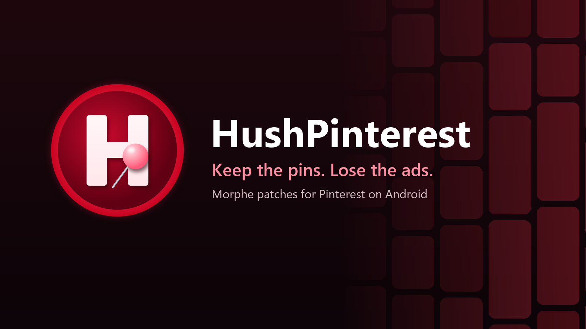
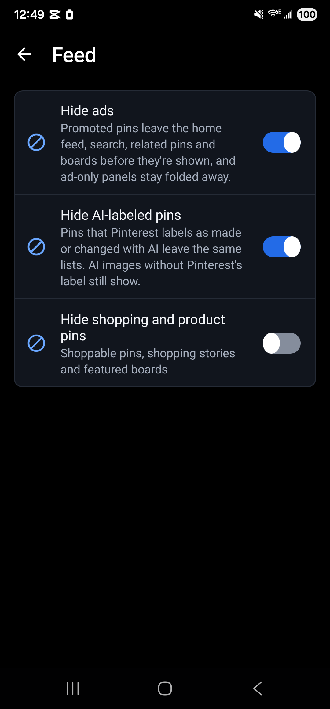

<p>
  
  <a href="LICENSE"></a>
  
  
  
</p>

#  HushPinterest

HushPinterest is a Morphe patch bundle for Android that takes promoted pins out of Pinterest and can hide the pins Pinterest labels as AI. It also adds pin downloads, browser and sharing choices, privacy controls and switches for the interface.

It's early. There's no release yet, and the patches haven't been tried on a signed-in phone. For now you'd have to build the bundle yourself (see [Building from source](#building-from-source)). Once 0.0.2 is out, Morphe Manager will be able to add this repo as a patch source and keep it updated.

## Which Pinterest

HushPinterest targets Pinterest **14.38.0**, version code 14388010 (`com.pinterest`), which needs Android 10. On Android 9, use **14.25.0** (version code 14258020) instead. It patches the same way. Use the universal APK, the single file that holds every screen density and processor type. APKMirror lists it as the "nodpi" variant. A split bundle (`.apkm`, `.xapk`) works too if Morphe Manager can merge it.

Other versions may patch, but each patch looks for code by what it does in those two builds, and Pinterest renames almost everything in every build. If a patch can't find its spot it says so and stops, rather than patching the wrong place.

## Install

1. Install [Morphe Manager](https://github.com/MorpheApp/morphe-manager) 1.33.0 or newer.
2. Build the bundle (below) and add the `.mpp` to Morphe Manager as a local patch source.
3. Pick the Pinterest 14.38.0 APK (14.25.0 on Android 9), keep the default patch selection or change it, and patch.

A patched Pinterest can't install over the stock one, because Android only accepts an update signed with the same key. Moving from stock requires removing it yourself after saving anything local you need. Boards and pins stored in your account return when you sign in, but that doesn't restore local settings or drafts. The development installer refuses stock or differently signed installs and downgrades. It never removes an app or grants all permissions.

## Signing in

**Continue with Google doesn't work on a patched Pinterest.** Google's sign-in checks the app's signature, and a patched app carries your key instead of Pinterest's. Sign in with your email and password. If your account was made with Google, set a password first on pinterest.com (Settings, then Account management) and use that.

Facebook sign-in hasn't been tried yet.

## Keep your signing key

Morphe Manager signs the patched Pinterest with a key it makes on your phone. Android installs an update over your patched Pinterest only when the update carries that same key.

- **Back it up right after your first patch.** In Morphe Manager, open Settings, then System, then Import & export, then Signing key, and tap Export. Keep the `Morphe.keystore` file somewhere private, because anyone who has it can sign an APK your phone will accept as an update.
- **On a new phone, import it before you patch anything.** Without your exported copy, nothing you patched earlier can be updated in place.

## Patches

There are 17 patches so far.

| Patch | What it does |
|---|---|
| `Disable analytics` | Stops Pinterest's usage-event and performance uploads and AppsFlyer tracking. A switch and Pause restore those runtime paths. Firebase Analytics is disabled in the manifest and stays disabled until you patch again without this patch. Sign-in, pin requests and Firebase push components are preserved. |
| `Disable update nag` | Stops Pinterest's in-app Play Store update prompts. You can still update Pinterest yourself. |
| `Download pins` | Adds Download pin to the pin menu for original images and the highest-resolution MP4 Pinterest supplies. Saves in Downloads on Android 10 or newer, or asks for a save location on Android 9. Turn it off in HushPinterest settings at any time. |
| `Filter pin menu` | Adds separate switches for collage, visual-search and Promote pin menu entries. Download, share and copy-link actions remain available. |
| `Hide AI-labeled pins` | Removes pins that Pinterest labels as made or changed with AI from the home feed, search, related pins and boards. AI images without Pinterest's label still show. |
| `Hide ads` | Removes promoted pins from the home feed, search, related pins and boards, and hides Pinterest's ad-only panels. Turn it off in HushPinterest settings at any time. |
| `Hide comments` | Collapses comments panels and comment previews beneath pins. It doesn't change who can comment on your pins. |
| `Hide header buttons` | Hides trailing header icon buttons. Back buttons, text actions and account controls remain available. |
| `Hide navigation buttons` | Adds separate switches for the Create and Updates navigation buttons. Home, Search and Profile remain available. |
| `Hide search history` | Hides recent-search rows and carousels on this device. It doesn't delete your account's search history. |
| `Hide shopping and product pins` | Hides shoppable pins, shopping stories and featured board placements. Off by default. Turn it on in HushPinterest settings when you want a feed without shopping. |
| `HushPinterest settings` | Adds HushPinterest settings to Pinterest. Long-press Pinterest's launcher icon, or open Additional settings in the app on Pinterest's App info page, to turn features on or off, pause HushPinterest, save your switches to a file or load them, and export diagnostics. The licenses are there too. |
| `No screenshot share menu` | Stops Pinterest's screenshot observer from opening sharing suggestions. Screenshots still work normally. |
| `Open links in your browser` | Opens a pin's Visit link in your web browser. Pinterest links and sign-in keep their usual behavior. Turn it off in HushPinterest settings at any time. |
| `Quiet email reminders` | Dismisses the optional confirm-your-email reminder. Account verification and sign-in checks still apply. |
| `Strip link tracking` | Removes known tracking parameters from URLs shared or copied from Pinterest. Keeps the destination, other parameters and opaque pin.it links. Turn it off or pause HushPinterest to share the original URLs. |
| `System share sheet` | Uses Android's share sheet when sharing a pin link. Screenshot and download actions keep their usual behavior. Turn it off in HushPinterest settings at any time. |

Morphe Manager selects Hide ads, Disable analytics, Strip link tracking and the settings by default. Pick the other patches when you want them. The optional shopping, pin-action and interface switches start off. The settings patch is required by the feature patches.

Switches change the runtime hooks without patching again. Reopen a screen to refresh controls that are already drawn. Pause makes those hooks follow Pinterest's original path. Startup tasks skipped by Disable analytics run again after a restart with its switch off or Pause on. That patch also changes a Firebase Analytics manifest flag when you patch. The flag stays disabled until you patch again without Disable analytics.

Disable update nag targets the Play Store prompt in 14.38.0. That prompt mechanism isn't present in 14.25.0, so the older build doesn't show its switch.

## Settings

Long-press the Pinterest icon and tap HushPinterest. You can also open Pinterest's App info page and tap Additional settings in the app, which Samsung phones call Configure in Pinterest.

<p>
  
  
  
  
</p>

These settings were captured on Android 16 with every patch included. All 19 feature switches saved and restored their choices. Pause and Resume were checked across restarts, and Supported links opened Android's link settings. Signed-in feed and pin-action checks are still pending.

Shopping filters and the new pin actions and interface controls start off. Create and Notifications have separate switches. The pin menu has separate choices for collage actions, Search image and Promote pin. Home, your profile and the ordinary Save, Share and Report actions stay available.

Download pins adds a Download row only when Pinterest supplies an original image or a direct MP4. It uses the highest resolution MP4 supplied for a video. Android 10 and newer save through Downloads. On Android 9, choose where to save the file. Streaming playlists aren't saved as videos.

Android 9 saves have a five-minute limit and a 256 MiB size limit. Empty or incomplete responses fail. If a save might have finished despite a storage error, HushPinterest keeps the file and asks you to check your chosen location. Pause prevents new requests but doesn't cancel a save already running.

The release check compares your Pinterest version with every version a release explicitly supports. Updates also has links to the release notes and installation steps. Those links don't download anything automatically.

## Opening Pinterest links

Android hands a pinterest.com or pin.it link to the official app only when that app proves it belongs to Pinterest's sites, and a re-signed app can't. To open those links in the patched app, go to its App info page, tap Open by default, then Add link, and select the Pinterest sites. HushPinterest's Links page has a button that goes straight there.

Manual selections were checked on Android 16. Links for pinterest.com, www.pinterest.com and pin.it opened the patched app.

## Privacy

HushPinterest doesn't collect anything and has no server. The release check stays off until you turn it on. Once it's on, HushPinterest asks `api.github.com` for its latest release at most once a day, when Pinterest starts, and again whenever you tap Check now. Download pins contacts Pinterest's media server when you tap Download. Browser and share actions open the destination you chose.

Disable analytics stops the targeted Pinterest usage uploads and AppsFlyer transport. It preserves Firebase messaging and the sign-in components, but that doesn't establish whether push notifications work on a re-signed build. That check still needs a signed-in device. Strip link tracking removes known tracking parameters from copied and shared links while keeping unknown parameters, signed links and opaque `pin.it` short links. Hide search history hides recent searches on this device. It doesn't delete Pinterest's server history.

Analytics hooks are checked before any Firebase manifest change. Local patch helpers refuse failed results even if the patching tool produced an APK. Runtime analytics controls stay inactive when that patch isn't installed.

The About and Licenses screens link to `github.com`, `gitlab.com` and `www.gnu.org`. Those open in your browser, and only when you tap one.

Shared pin links use `www.pinterest.com`. Downloads use media addresses Pinterest supplies under `pinimg.com`. Browser discovery checks installed handlers for `example.com` without opening or loading that address. When Disable analytics is off or paused, its AppsFlyer wrapper uses the SDK's original connection path.

## Reporting a problem

Open an [issue](https://github.com/SysAdminDoc/HushPinterest/issues) and say what you did and what you saw. It helps a lot to attach a diagnostic report. In HushPinterest's settings, tap Export diagnostic report, then Copy quick report or Save full report. The report carries Pinterest's version, your Android version and what each patch did. HushPinterest takes out the account, pin and board ids it recognizes, but give it a read before you share it. Nothing is sent anywhere unless you paste or attach it yourself.

## Where the patches come from

| Source | What came from it |
|---|---|
| [SysAdminDoc/HushTelegram](https://github.com/SysAdminDoc/HushTelegram) at `8c54a1d` | The Gradle build, the shared extension library with its settings screen, diagnostics, pause and backup, the bytecode helpers, and the checks that apply every patch to a real APK before a release. Most of that came to HushTelegram from [HushThreads](https://github.com/SysAdminDoc/HushThreads) and [Hushfacebook](https://github.com/SysAdminDoc/Hushfacebook). |
| [Morphe](https://github.com/MorpheApp) and [ReVanced](https://gitlab.com/ReVanced/revanced-patches) | The patcher and the patch template. Everything above grew from their code. |

The Pinterest patches were written for this project by reading Pinterest 14.25.0 itself, and checked again against 14.38.0. Every source file says where it came from in its header, and [provenance.json](provenance.json) maps each file to the project and commit it came from, with its license. The [source ledger](sources/pinterest-sources.json) lists the other Pinterest patch projects that were reviewed, what each one does and why nothing was copied from it.

## Building from source

You need JDK 21 and the Android SDK. The Morphe patcher comes from GitHub Packages, so you also need a GitHub token with `read:packages`.

```bash
export GITHUB_ACTOR=<your GitHub user>
export GITHUB_TOKEN=<a token with read:packages>
./gradlew :patches:generatePatchesList
./gradlew :patches:buildAndroid
```

The bundle lands in `patches/build/release/patches-<version>.mpp`, beside its SHA-256 and a CycloneDX SBOM of every library that goes into it. Run `generatePatchesList` before `buildAndroid`, or the bundle loses its Android payload.

Tests: `./gradlew :patches:test :extensions:pinterest:test`. Set `HUSHPINTEREST_FIXTURE_DIR` to the directory containing every APK named in `AppCompatibilities.kt` before pushing a patch change. The push check rejects missing fixtures.

Device helpers acquire an exclusive serial lease before writing to a phone or emulator. Set `HUSHPINTEREST_DEVICE_LEASE_DIR` to the shared pool's lease directory, or pass it explicitly. A caller can pass its lease token. Child checks retain that caller's lease. Expired leases remain untouched until the previous test has been confirmed stopped. Installs verify the device identity and both APK signers, then use an in-place update that preserves existing permissions and app data.

`scripts/patch-for-device.ps1` returns the verified APK path from its own folder under `-OutDir`. Concurrent runs keep separate output and temporary files. Use `-OutputApk` for a specific final path. An existing path is refused. Failed or unreadable patch reports discard that run's APK before installation.

Build dependencies have a separate advisory check. Run `./gradlew :patches:buildDependencyReport`, then `pwsh -NoProfile -File scripts/build-advisories.ps1`. High, critical or unrated findings and failed queries stop a push. Lower-severity findings are reported.

## License

[GPL-3.0](LICENSE), with the Morphe section 7 notices carried in [NOTICE](NOTICE). Pinterest is a trademark of Pinterest, Inc. HushPinterest isn't made by or connected with Pinterest.
